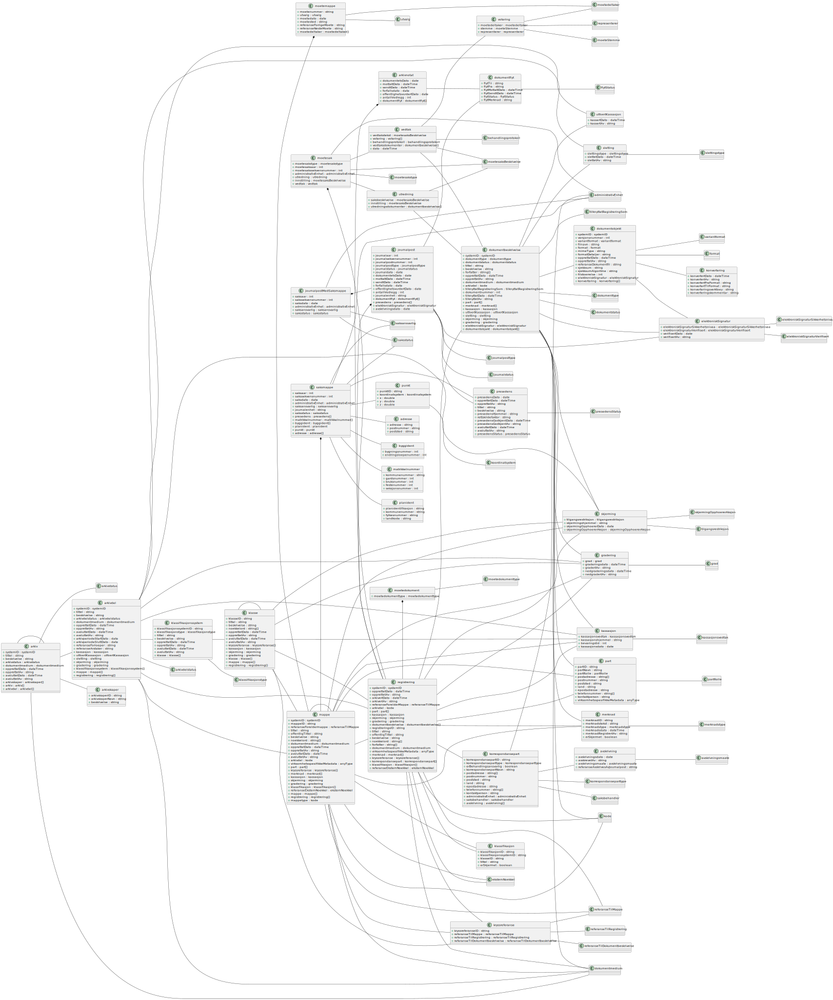

# Arkivstruktur

Skjema: `no.ks.fiks.arkiv.v1.arkivstruktur.xsd`

Inneholder objekter i arkiv. Brukes for meldinger som henter data fra arkivet.

Diagram generert fra xsd til PlantUML vha verktøy.

