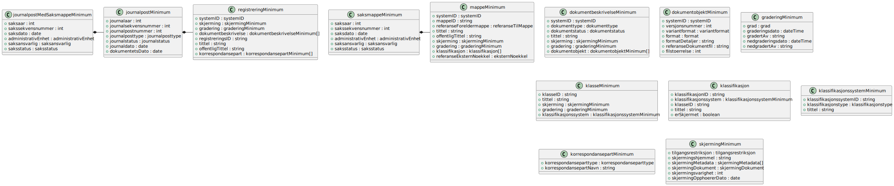

# Arkivstruktur - minimum

Skjema: `no.ks.fiks.arkiv.v1.arkivstrukturMinimum.xsd`

Inneholder objekter i arkiv, redusert med minimum av det man trenger i resultatet av et søk f.eks.. Brukes for meldinger som henter data fra arkivet og ikke ønsker alt tilbake.

Diagram generert fra xsd til PlantUML vha verktøy.

