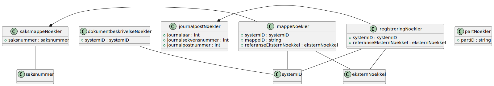

# Arkivstruktur - nøkler

Skjema: `no.ks.fiks.arkiv.v1.arkivstrukturNoekler.xsd`

Inneholder objekter i arkiv, redusert til bare nøkler. Brukes for meldinger som henter data fra arkivet og ikke ønsker alt tilbake, bare nøklene.

Diagram generert fra xsd til PlantUML vha verktøy.

