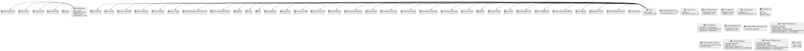

# Metadatakatalog

Skjema: `no.ks.fiks.arkiv.v1.metadatakatalog.xsd`

Inneholder felles enkle objekter/typer i Fiks Arkiv. Brukes i de fleste skjema.

Diagram generert fra xsd til PlantUML vha verktøy.

