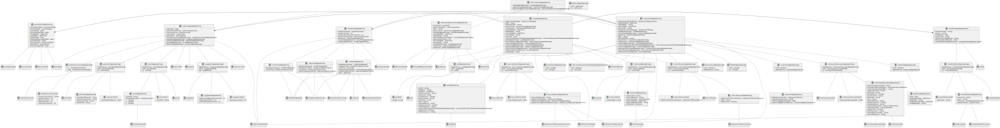

# Oppdater Arkivmelding

Skjema: `no.ks.fiks.arkiv.v1.arkivering.arkivmelding.oppdater.xsd`

Diagram generert fra xsd til PlantUML vha verktøy. Relasjoner er lagt til manuelt etterpå.
Se filen _SchemaModels/no/ks/fiks/arkiv/v1/arkivering/arkivmelding/oppdater-relations.pu_ for PlantUML kode.

Merk at diagrammene ikke viser detaljer for objekter som kommer fra andre skjema som f.eks. `metadatakatalog.xsd` og `arkivstruktur.xsd`.
Da må man sjekke disse diagrammene.

