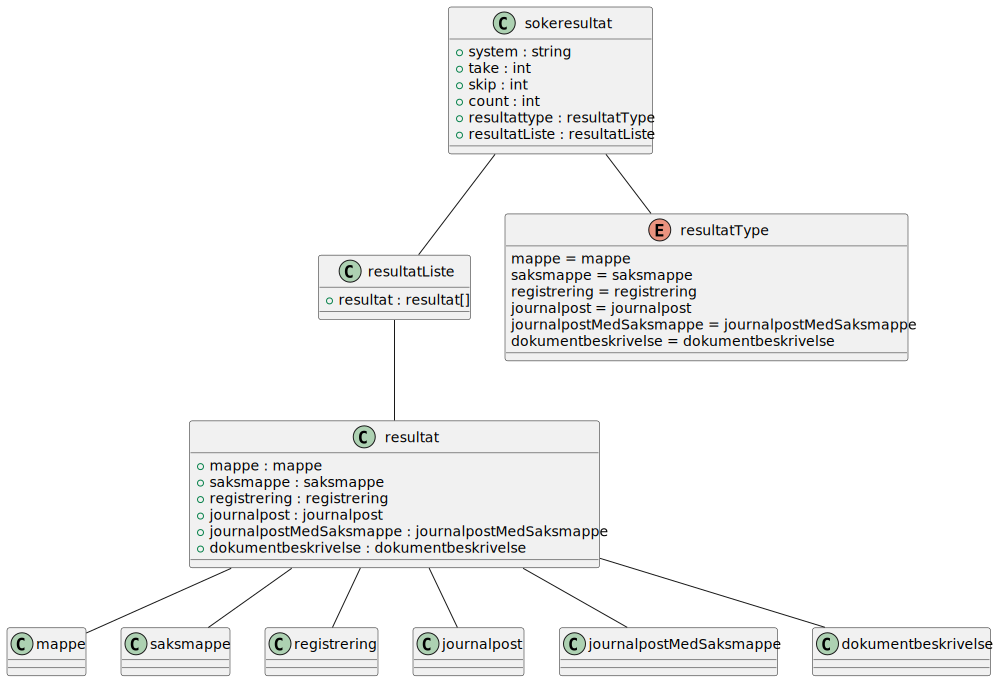
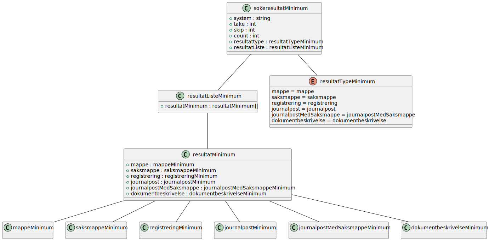
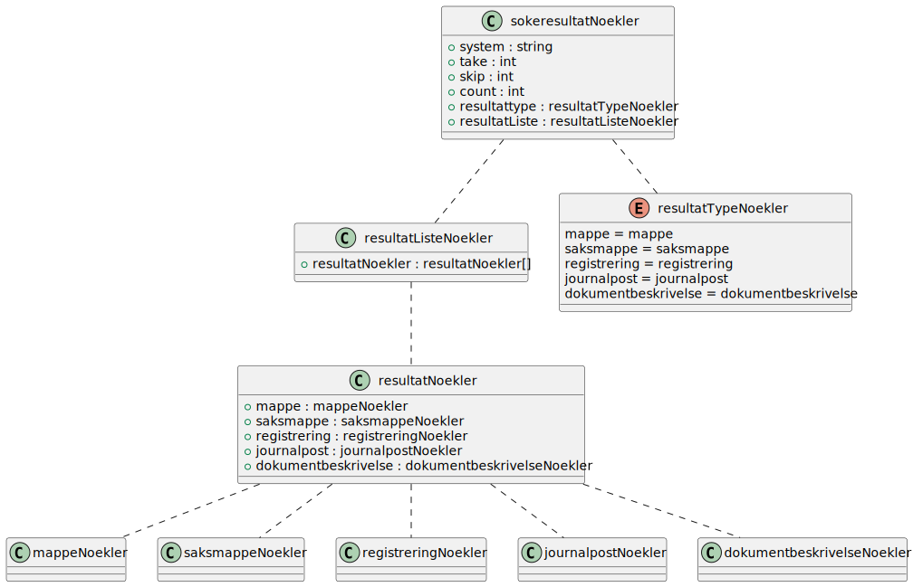

# Resultater for Sok

Skjema:
- `no.ks.fiks.arkiv.v1.innsyn.sok.resultat.minium.xsd`
- `no.ks.fiks.arkiv.v1.innsyn.sok.resultat.noekler.xsd`
- `no.ks.fiks.arkiv.v1.innsyn.sok.resultat.utvidet.xsd`

Diagram generert fra xsd til PlantUML vha verktøy. Relasjoner er lagt til manuelt etterpå.
Se filene:
- _SchemaModels/no/ks/fiks/arkiv/v1/innsyn/sok/resultat/minimum-relations.pu_ for PlantUML kode.
- _SchemaModels/no/ks/fiks/arkiv/v1/innsyn/sok/resultat/noekler-relations.pu_ for PlantUML kode.
- _SchemaModels/no/ks/fiks/arkiv/v1/innsyn/sok/resultat/utvidet-relations.pu_ for PlantUML kode.

Merk at diagrammene ikke viser detaljer for objekter som kommer fra andre skjema som f.eks. `metadatakatalog.xsd` og `arkivstruktur.xsd`.
Da må man sjekke disse diagrammene.

### Utvidet resultat

### Minimum resultat

### Noekler resultat 

