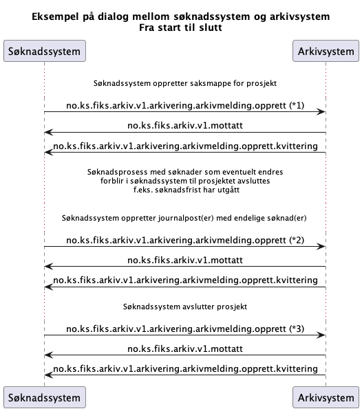

# Søknadssystem med søknadsfrist

*Dette er et foreløpig utkast*

Kommunikasjon mellom søknadssystem og arkiv vha Fiks-Arkiv protokollen.

Merk at Fiks-Protokoll/Fiks-IO er utelatt i modellen for å forenkle den. Den er meldingssystem som ligger mellom søknadssystem og arkivsystem.
Alle meldinger vil gå via Fiks-Protokoll.

## Meldingsutveksling

Denne meldingsutvekslingen viser hvordan man som søknadssystem skal arkivere gjennom en søknadsprosess, fra søknadsprosess starter til den avsluttes. 
Dette gjelder søknadssystemer hvor det er søknadsfrister. 
Anbefalingen er at søknadsprosesser med søknader som eventuelt endres forblir i søknadssystem til prosjektet avsluttes, som f.eks. søknadsfrist har utgått.

Forklaring til diagram

*1) Arkivmelding som oppretter saksmappe i arkivet for dette søknadsprosjektet. 

*2) Arkivmelding som oppretter en eller flere journalposter med endelige søknader på saksmappen man opprettet. Det vil si at man skal ikke sende en journalpost for en søknad som ikke er ferdig. Hvis den kan endres ville man måttet forholde seg til oppdateringer av journalposter og dokumenter som er unødvendig og kompliserer prosessen.

Feltet `<regel>` definerer hvilken regel som skal brukes for forhåndsdefinerte verdier på journalpost og dokumenter. Se mer under [Meldingsdetaljer](#meldingsdetaljer) -> [Arkivmelding](#arkivmelding) -> [Regel](#regel)

*3) Søknadsprosess er ferdig og avsluttes. Resterende journalposter overføres, i en eller flere meldinger. I disse overføringene sendes følgende: Annonse, offentlig søkerliste, utvidet søkerliste, innstillingsvedtak og eventuelle notater og dokumenter som er vedlagt rekrutteringsprosjektet. Saksmappen kan også oppdateres ved behov via en egen oppdater-melding: `no.ks.fiks.arkiv.v1.arkivering.arkivmelding.oppdater`.

## Meldingsdetaljer

### Arkivmelding

#### Regel
Feltet `<regel>` bestemmer hvilket regelsett som skal brukes for system som sender inn arkivmelding.
Referanse til regelsettet med  standardverdier ref gammelt skjemamottak.
