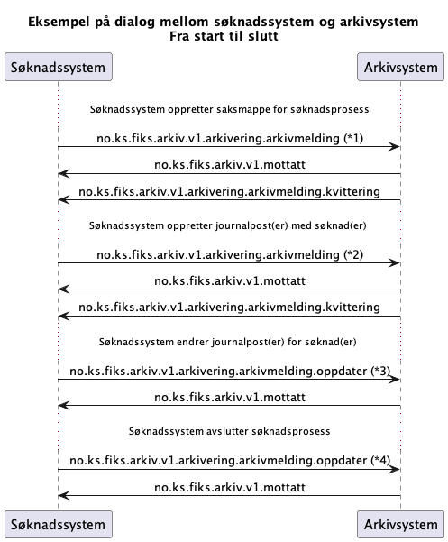

# UseCase: Søknadssystem

Kommunikasjon mellom søknadssytem og arkiv vha Fiks-Arkiv protokollen.

## Meldingsutveksling

Forklaring fra diagram

*1) Arkivmelding som oppretter saksmappe i arkivet. 

*2) Arkivmelding som oppretter en eller flere journalposter på saksmappen man opprettet. Feltet `<regel>` definerer hvilken regel som skal brukes for forhåndsdefinerte verdier på journalpost og dokumenter. Se mer under [Meldingsdetaljer](#meldingsdetaljer) -> [Arkivmelding](#arkivmelding) -> [Regel](#regel)

*3) En endring blir gjort på en søknad eller prosessen som krever å bli arkivert. Oppdater melding for journalpost(er) eller saksmappe

*4) Søknadsprosess er ferdig og avsluttes. Oppdater melding sendes for saksmappe og evt journalpost(er).  

## Meldingsdetaljer

### Arkivmelding

#### Regel-felt
*Til vurdering i issue [her](https://github.com/ks-no/fiks-arkiv-specification/issues/81)*

Feltet `<regel>` bestemmer hvilket regelsett som skal brukes for system som sender inn arkivmelding.
Referanse til regelsettet med  standardverdier ref gammelt skjemamottak.

#### Oppdatering