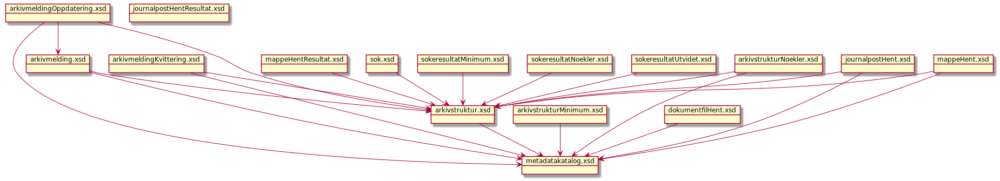

# Kontrakter og meldingstyper for Fiks Arkiv

> Fiks Arkiv er en modernisering av GI Arkiv 1.1 og det nye grensesnittet som anbefales brukt når kommunen skal sette opp kommunikasjonen mellom et fagsystem og en arkivløsning.

## Protokollen

### Fiks Arkiv versjon 1 (V1)
#### Meldingstyper
Se filen `Schema/V1/meldingstyper/meldingstyper.json` for hvilke meldingstyper som finnes og hvordan de henger sammen.

#### Schema

Skjemafilene ligger under `Schema/V1`  

##### Avhengighet mellom schemas

## Dokumentasjon
For mer utfyllende dokumentasjon om protokollen kan man lese mer her: [ks.no](https://www.ks.no/fagomrader/digitalisering/felleslosninger/verktoykasse-plan--og-byggesak/verktoy/sammenhengende-tjenester---integrasjoner/fiks-arkiv/).

