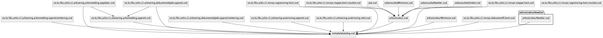

# Kontrakter og meldingstyper for Fiks Arkiv

> Fiks Arkiv er en modernisering av GI Arkiv 1.1 og det nye grensesnittet som anbefales brukt når kommunen skal sette opp kommunikasjonen mellom et fagsystem og en arkivløsning.

## Protokollen

### Fiks Arkiv versjon 1 (V1)

#### Meldingstyper

Se filen [`meldingstyper.json`](Schema/V1/meldingstyper/meldingstyper.json) for hvilke meldingstyper som er i denne protokollen og hvordan de henger sammen. Man kan også se på den genererte [UML-modellen](https://github.com/ks-no/fiks-arkiv-specification/blob/main/Schema/V1/meldingstyper/meldingstyper.svg) som viser hvordan meldingstypene henger sammen.
Hver meldingstype som har en payload har et tilhørende xsd-skjema med samme navn. 

#### Kodelister

Under mappen kodelister ligger eksempler på kodelister i json-format samt diagram som gir oversikt over innhold.

#### Skjema

Skjemaene er i xsd-format og ligger under `Schema/V1`.
Det er et skjema for hver meldingstype som har en payload og som har samme navn som meldingstype, samt delte skjema med fellest datatyper. 

##### Avhengighet mellom skjemaer

#### Distribuerte bibliotek for Fiks Arkiv

KS leverer også bibliotek for Java og .NET som inneholder skjemaene, meldingstyper.json filen, hjelpeklasser og genererte modeller fra skjema.

##### Java
Maven Central: https://central.sonatype.com/artifact/no.ks.fiks/fiks-arkiv

##### .NET
Nuget.org: https://www.nuget.org/packages/KS.Fiks.Arkiv.Models.V1

## Dokumentasjon

### [Wiki - utfyllende dokumentasjon av Fiks-Arkiv protokollen](https://github.com/ks-no/fiks-arkiv-specification/wiki)
For mer utfyllende dokumentasjon om protokollen kan man lese mer i [wiki for Fiks Arkiv](https://github.com/ks-no/fiks-arkiv-specification/wiki)

### [Fiks plattformen og Fiks-Arkiv - developers.fiks.ks.no](https://developers.fiks.ks.no/fiks-plattform/tjenester/fiksprotokoll/arkiv/)
For informasjon om Fiks plattformen og Fiks Arkiv i den sammenheng kan man lese mer på [ks.no](https://www.ks.no/fagomrader/digitalisering/felleslosninger/verktoykasse-plan--og-byggesak/verktoy/sammenhengende-tjenester---integrasjoner/fiks-arkiv/) og på [developers.fiks.ks.no](https://developers.fiks.ks.no/fiks-plattform/tjenester/fiksprotokoll/arkiv/)

### [Brukstilfeller, meldinger og tilhørende skjema](Dokumentasjon/V1/README.md)

I mappen [Dokumentasjon](Dokumentasjon/V1/README.md) i dette repoet finner man dokumentasjon og **diagrammer** for denne versjonen av protokollen. Diagrammene er stort sett utarbeidet vha PlantUML.
Kildekoden i PlantUML for diagrammene ligger da der også hvis man ønsker å bruke de som utgangspunkt i videre arbeid eller ønsker å forbedre de.

### Generering av diagrammer
Vi bruker [PlantUML](https://plantuml.com/) for å tegne diagrammer som så blir eksportert til png og svg filer. For eksempel bruker vi PlantUML til å generere oversikten over sammenhengen mellom meldingstyper ut i fra `meldingstyper.json` filen.
Vi genererer også PlantUML kode fra xsd filene for å vise datamodellen vha PHP biblioteket **[xsdata](https://pypi.org/project/xsdata-plantuml/)**

For å generere nye modeller i prosjektet kan man kjøre `generate-uml.sh` scriptet.

